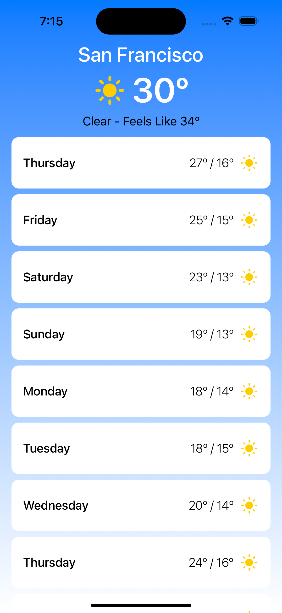
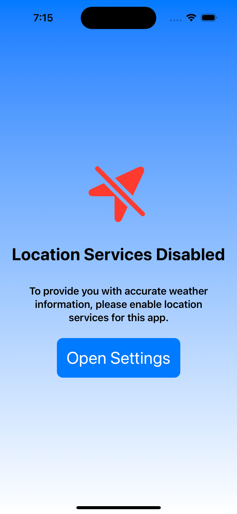

## WeatherApp (iOS)
Welcome to WeatherApp, a simple and intuitive weather application that provides you with real-time weather information for your current location and a 10-day weather forecast. This README file will guide you through the app's functionality, installation.

# Application Screenshots

# Requirement
- iOS 16.0+
- Xcode 14.0.1

# Installation
- To run the project :
- Open WeatherApp.xcodeproj 

# Language 
Swift 5.0

# Version
1.0 

# Usage
## WeatherApp with MVI architecture is designed using StateMachinePackage with a reactive and organized structure:

-   Upon opening the app, it will request access to your current location. Allow access to get accurate weather data for your location.

-   The app will display the current weather conditions for your location, including temperature, humidity, wind speed, and more.

-   Display list to the 10-day forecast section to view weather predictions for the upcoming days.

# Assumptions        
-   The app is designed for iPhones only.        
-   App support english language.
-   Mobile platform supported: iOS (16.x)        
-   Device support - iPhone which supports iOS 16
-   iPhone app support would be limited to portrait mode.

# Unit Testing
- Unit testing is done by using XCTest.

# Improvements
-  Enhance the MVI structure for better code organization and maintainability.
-  Implement SwiftLint
-  Save last location
-  Handling sunny, cloudy and rainny days images

# License
## MIT License

### Copyright (c) 2019 

Permission is hereby granted, free of charge, to any person obtaining a copy
of this software and associated documentation files (the "Software"), to deal
in the Software without restriction, including without limitation the rights
to use, copy, modify, merge, publish, distribute, sublicense, and/or sell
copies of the Software, and to permit persons to whom the Software is
furnished to do so, subject to the following conditions:

The above copyright notice and this permission notice shall be included in all
copies or substantial portions of the Software.

THE SOFTWARE IS PROVIDED "AS IS", WITHOUT WARRANTY OF ANY KIND, EXPRESS OR
IMPLIED, INCLUDING BUT NOT LIMITED TO THE WARRANTIES OF MERCHANTABILITY,
FITNESS FOR A PARTICULAR PURPOSE AND NONINFRINGEMENT. IN NO EVENT SHALL THE
AUTHORS OR COPYRIGHT HOLDERS BE LIABLE FOR ANY CLAIM, DAMAGES OR OTHER
LIABILITY, WHETHER IN AN ACTION OF CONTRACT, TORT OR OTHERWISE, ARISING FROM,
OUT OF OR IN CONNECTION WITH THE SOFTWARE OR THE USE OR OTHER DEALINGS IN THE
SOFTWARE.
